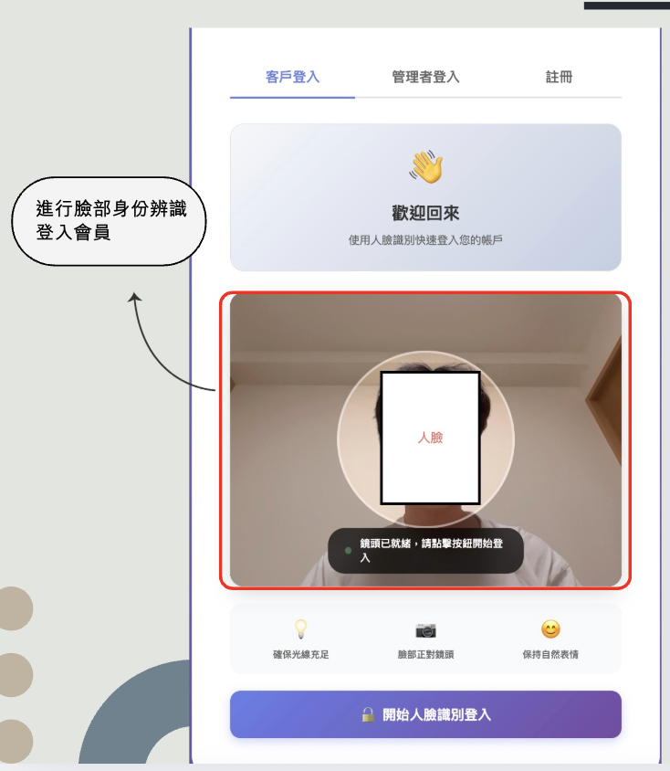
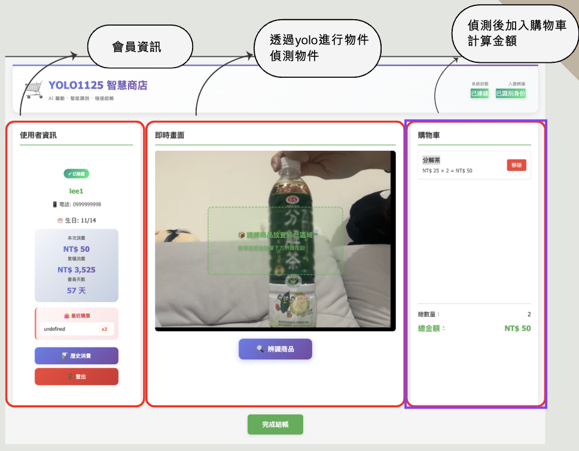

# YOLO 智慧無人商店系統

基於 YOLOv8 物品辨識與人臉識別技術的智慧無人商店結帳系統，支援自動商品識別、人臉登入、即時購物車與自動結帳功能。


*人臉識別登入介面*


*商品識別與購物車介面*


*YOLO 模型驗證結果*

---

## 系統特色

### 🎯 智慧商品識別
- 使用 YOLOv8 訓練的自定義模型
- 支援即時商品偵測（元翠茶、分解茶）
- 信心度門檻 0.8，確保識別準確性
- 自動框選並標註商品資訊

### 👤 人臉識別登入
- 自動識別回訪顧客
- 支援新用戶快速註冊
- 128維人臉特徵向量儲存
- 人臉容忍度 0.6，平衡安全與便利

### 🛒 智慧購物車
- 商品自動加入購物車
- 同商品自動累加數量
- 即時計算總金額
- 支援手動移除商品

### 💰 自動結帳系統
- 一鍵完成結帳
- 交易記錄永久保存
- 支援交易歷史查詢
- MongoDB 儲存所有交易數據

### 📊 管理後台
- 用戶管理功能
- 交易記錄查詢
- 系統統計數據
- 商品資訊管理

---

## 系統架構

### 技術棧

**後端**:
- FastAPI - 高效能 Web 框架
- Python 3.8+ - 主要程式語言
- MongoDB - NoSQL 資料庫
- WebSocket - 即時雙向通訊

**AI/ML**:
- YOLOv8 (Ultralytics) - 物品偵測
- face-recognition - 人臉識別
- OpenCV - 影像處理
- NumPy - 數值計算

**前端**:
- HTML5/CSS3 - 使用者介面
- Vanilla JavaScript - 前端邏輯
- WebRTC - 鏡頭存取
- WebSocket Client - 即時通訊

### 系統流程

```
使用者站在鏡頭前
    ↓
人臉識別 (首次註冊 / 自動登入)
    ↓
展示商品給鏡頭
    ↓
YOLO 偵測商品 (信心度 >= 0.8)
    ↓
自動加入購物車
    ↓
確認商品並結帳
    ↓
交易記錄儲存至 MongoDB
```

---

## 快速開始

### 系統需求

**硬體**:
- 電腦 (建議 8GB+ RAM)
- 網路攝影機
- (選用) NVIDIA GPU (加速 YOLO 推論)

**軟體**:
- Python 3.8 或更高版本
- MongoDB 6.0 或更高版本
- 現代瀏覽器 (Chrome, Edge, Firefox)

### 安裝步驟

#### 1. 克隆專案

```bash
git clone https://github.com/ws97109/yolo-for-shop.git
cd yolo-for-shop
```

#### 2. 安裝 MongoDB

**macOS (Homebrew)**:
```bash
brew tap mongodb/brew
brew install mongodb-community@6.0
brew services start mongodb-community@6.0
```

**Ubuntu/Debian**:
```bash
sudo apt-get install -y mongodb
sudo systemctl start mongodb
sudo systemctl enable mongodb
```

**驗證 MongoDB 運行**:
```bash
mongosh
# 應該可以成功連線到 MongoDB
```

#### 3. 安裝 Python 依賴

```bash
cd yolo1125
pip install -r requirements.txt
```

**注意事項**:
- `dlib` 需要 CMake，如未安裝請先安裝：
  - macOS: `brew install cmake`
  - Ubuntu: `sudo apt-get install cmake python3-dev`

#### 4. 初始化資料庫

```bash
python scripts/init_db.py
```

成功後應看到：
```
✅ MongoDB 連線成功
✅ 插入 2 個商品
✅ 資料庫初始化完成！
```

#### 5. 啟動系統

```bash
# 確保在 yolo1125 目錄下
python -m uvicorn backend.main:app --host 0.0.0.0 --port 8000 --reload
```

#### 6. 開啟瀏覽器

訪問: `http://localhost:8000`

---

## 使用指南

### 首次使用 (註冊新用戶)

1. 開啟網頁後，站在鏡頭前
2. 系統偵測到未知人臉
3. 填寫註冊表單（姓名、電話、生日）
4. 系統儲存人臉特徵
5. 自動登入，開始購物

### 回訪使用 (自動登入)

1. 站在鏡頭前
2. 系統自動識別人臉
3. 顯示「歡迎回來，{您的姓名}」
4. 直接開始購物

### 購物流程

1. **展示商品**: 將商品（元翠茶或分解茶）對準鏡頭
2. **自動識別**: 系統顯示綠色偵測框和商品資訊
3. **加入購物車**: 商品自動加入右側購物車
4. **調整數量**: 重複展示可增加數量，或點擊「移除」按鈕
5. **確認結帳**: 檢查購物車內容，點擊「完成結帳」
6. **完成交易**: 系統顯示交易成功，購物車清空

### 管理後台

訪問: `http://localhost:8000/admin.html`

預設帳號密碼在 `.env` 檔案中設定（開發環境預設為 admin/admin123）

功能:
- 查看所有用戶列表
- 查詢交易記錄
- 檢視系統統計
- 管理用戶資訊

---

## 專案結構

```
yolo-for-shop/
├── yolo1125/                          # 主要應用程式
│   ├── backend/                       # 後端服務
│   │   ├── main.py                    # FastAPI 應用程式
│   │   ├── config.py                  # 配置設定
│   │   ├── database.py                # MongoDB 連接
│   │   ├── models/                    # 資料模型
│   │   │   ├── user.py                # 使用者模型
│   │   │   ├── product.py             # 商品模型
│   │   │   └── transaction.py         # 交易模型
│   │   └── services/                  # 業務邏輯服務
│   │       ├── yolo_service.py        # YOLO 商品偵測
│   │       ├── face_service.py        # 人臉識別
│   │       └── cart_service.py        # 購物車管理
│   ├── frontend/                      # 前端應用
│   │   ├── index.html                 # 購物主頁面
│   │   ├── login.html                 # 登入頁面
│   │   ├── admin.html                 # 管理後台
│   │   └── static/                    # 靜態資源
│   │       ├── css/style.css          # 樣式表
│   │       └── js/                    # JavaScript 模組
│   │           ├── main.js            # 主應用邏輯
│   │           ├── camera.js          # 鏡頭管理
│   │           ├── websocket.js       # WebSocket 通訊
│   │           ├── cart.js            # 購物車邏輯
│   │           ├── login.js           # 登入邏輯
│   │           └── admin.js           # 管理後台邏輯
│   ├── data/                          # 資料存儲
│   │   └── faces/                     # 使用者人臉圖片
│   ├── scripts/                       # 工具腳本
│   │   ├── init_db.py                 # 資料庫初始化
│   │   ├── test_yolo.py               # YOLO 測試
│   │   └── test_cart.py               # 購物車測試
│   └── requirements.txt               # Python 依賴
├── runs/                              # YOLO 訓練輸出
│   └── detect/
│       └── supermarket_product_detector/
│           └── weights/
│               └── best.pt            # 訓練完成的模型
├── image/                             # 系統截圖
│   ├── face.png                       # 人臉識別畫面
│   ├── shop.png                       # 購物車畫面
│   └── val_batch0_pred.jpg            # 驗證結果
├── SYSTEM_ARCHITECTURE.md             # 系統架構文件
└── README.md                          # 本文件
```

---

## 核心功能說明

### YOLO 商品偵測

**模型配置**:
- 模型路徑: `runs/detect/supermarket_product_detector/weights/best.pt`
- 信心度門檻: 0.8
- 處理頻率: 每 0.2 秒
- 支援類別: 元翠茶 (class 0)、分解茶 (class 1)

**偵測流程**:
1. 前端每秒傳送影像幀至後端 (WebSocket)
2. YOLO 模型進行推論
3. 過濾信心度低於 0.8 的結果
4. 查詢 MongoDB 取得商品資訊
5. 回傳偵測結果至前端
6. 前端繪製偵測框和標籤

### 人臉識別系統

**識別方式**:
- 演算法: face-recognition (基於 dlib)
- 特徵維度: 128 維向量
- 容忍度: 0.6 (距離越小越嚴格)
- 偵測模型: HOG (Histogram of Oriented Gradients)

**識別流程**:
1. 偵測影像中的人臉位置
2. 提取 128 維人臉特徵
3. 與資料庫中所有已知人臉比對
4. 計算歐氏距離，找出最相似者
5. 距離 < 0.6 視為同一人

**註冊流程**:
1. 偵測新人臉
2. 使用者填寫資料（姓名、電話、生日）
3. 儲存人臉特徵至 MongoDB
4. 儲存人臉圖片至 `data/faces/`
5. 加入記憶體快取

### 購物車管理

**功能特性**:
- Session 隔離（每個瀏覽器獨立購物車）
- 自動去重（同商品累加數量）
- 即時計算總金額
- WebSocket 即時同步

**資料結構**:
```python
{
    'session_id': 'unique-session-id',
    'user_id': 'user-object-id',
    'items': [
        {
            'product_id': 'product-id',
            'name': '元翠茶',
            'unit_price': 50,
            'quantity': 2,
            'subtotal': 100
        }
    ],
    'total_quantity': 2,
    'total_amount': 100
}
```

### WebSocket 通訊

**前端 → 後端**:
- `frame`: Base64 編碼的影像幀
- `ping`: 心跳信號
- `cart_remove`: 移除購物車商品

**後端 → 前端**:
- `user_login`: 使用者登入成功
- `detections`: YOLO 偵測結果
- `product_added`: 商品加入購物車
- `cart_updated`: 購物車狀態更新
- `face_detected`: 人臉偵測結果

---

## API 文件

### REST API 端點

#### 認證相關
- `POST /api/face-login` - 人臉識別登入
- `POST /api/face-register` - 註冊新用戶
- `POST /api/register` - 一般註冊
- `POST /api/checkout` - 結帳

#### 資訊查詢
- `GET /api/products` - 取得商品列表
- `GET /api/user/{user_id}/info` - 取得使用者資訊
- `GET /api/user/{user_id}/transactions` - 取得交易歷史
- `GET /api/health` - 健康檢查

#### 管理員
- `POST /api/admin-login` - 管理員登入
- `GET /api/admin/users` - 取得所有使用者
- `GET /api/admin/stats` - 取得統計資料
- `GET /api/admin/user/{user_id}/transactions` - 查看使用者交易
- `PUT /api/admin/user/{user_id}` - 更新使用者資訊
- `DELETE /api/admin/user/{user_id}` - 刪除使用者

### WebSocket 端點

- `WS /ws/{session_id}` - WebSocket 連線

---

## 資料庫設計

### Collections

#### users
```javascript
{
    _id: ObjectId,
    name: String,                    // 使用者姓名
    phone: String,                   // 電話號碼 (唯一索引)
    birthday: DateTime,              // 生日 (可選)
    face_encoding: Array<Float>,     // 128維人臉特徵
    face_image_path: String,         // 人臉圖片路徑
    created_at: DateTime,            // 建立時間
    last_visit: DateTime             // 最後訪問時間
}
```

#### products
```javascript
{
    _id: ObjectId,
    name: String,                    // 商品名稱
    price: Number,                   // 價格
    yolo_class_id: Number,           // YOLO 類別 ID (唯一索引)
    yolo_class_name: String,         // YOLO 類別名稱
    created_at: DateTime             // 建立時間
}
```

#### transactions
```javascript
{
    _id: ObjectId,
    user_id: ObjectId,               // 使用者 ID (索引)
    user_name: String,               // 使用者姓名
    items: Array<{                   // 購買商品列表
        product_id: String,
        name: String,
        unit_price: Number,
        quantity: Number,
        subtotal: Number
    }>,
    total_quantity: Number,          // 總數量
    total_amount: Number,            // 總金額
    created_at: DateTime             // 交易時間 (索引)
}
```

---

## 故障排除

### MongoDB 連線失敗

```bash
# 檢查 MongoDB 狀態
brew services list | grep mongodb          # macOS
sudo systemctl status mongodb              # Linux

# 重新啟動 MongoDB
brew services restart mongodb-community@6.0  # macOS
sudo systemctl restart mongodb               # Linux

# 測試連線
mongosh
```

### 鏡頭無法啟動

- 檢查瀏覽器權限設定（允許鏡頭存取）
- 確認鏡頭未被其他程式佔用
- 嘗試使用 Chrome 或 Edge 瀏覽器
- 確認使用 HTTPS 或 localhost

### YOLO 模型未找到

```bash
# 檢查模型檔案是否存在
ls -la runs/detect/supermarket_product_detector/weights/best.pt

# 如果不存在，需要重新訓練或下載模型
# 確認 backend/config.py 中的 YOLO_MODEL_PATH 設定正確
```

### Python 套件安裝失敗

**face-recognition / dlib 安裝問題**:

```bash
# macOS
brew install cmake
pip install dlib
pip install face-recognition

# Ubuntu/Debian
sudo apt-get install cmake python3-dev
pip install dlib
pip install face-recognition

# Windows (建議使用預編譯版本)
pip install dlib-binary
pip install face-recognition
```

**OpenCV 安裝問題**:

```bash
# 如果 opencv-python 安裝失敗
pip install opencv-python-headless

# 或指定版本
pip install opencv-python==4.8.1.78
```

### WebSocket 連線失敗

- 確認後端服務正在運行
- 檢查防火牆設定
- 確認使用正確的 session_id
- 查看瀏覽器 Console 錯誤訊息

---

## 效能優化

### 影像處理
- 商品偵測頻率: 0.2 秒間隔
- 人臉識別頻率: 1 秒間隔
- YOLO 信心度過濾: >= 0.8
- 人臉容忍度: 0.6

### 快取機制
- 商品資訊記憶體快取
- 已知人臉特徵快取
- Session 資料快取

### 資料庫索引
- `users.phone`: 唯一索引
- `products.yolo_class_id`: 唯一索引
- `transactions.user_id`: 一般索引
- `transactions.created_at`: 一般索引

---

## 開發狀態

✅ **Task 001**: 專案結構與 MongoDB 設定
✅ **Task 002**: FastAPI 主程式與 WebSocket
✅ **Task 003**: 前端頁面與鏡頭存取
✅ **Task 004**: YOLO 模型整合
✅ **Task 005**: 人臉識別服務
✅ **Task 006**: 購物車功能
✅ **Task 007**: 結帳流程
✅ **Task 008**: 系統測試與優化

🎉 **系統已完成開發並通過所有測試！**

---

## 測試報告

系統已通過以下測試：
- ✅ 資料庫連線測試
- ✅ YOLO 商品偵測測試
- ✅ 購物車完整流程測試
- ✅ 結帳與交易記錄測試
- ✅ 資料一致性檢查
- ✅ WebSocket 即時通訊測試
- ✅ 人臉識別準確度測試

詳細文件:
- [SYSTEM_ARCHITECTURE.md](SYSTEM_ARCHITECTURE.md) - 完整系統架構說明
- [yolo1125/README.md](yolo1125/README.md) - 應用程式說明

---

## 技術支援

### 常見問題

**Q: 人臉識別不準確怎麼辦？**
A: 可以調整 `backend/config.py` 中的 `FACE_MATCH_TOLERANCE` 參數。數值越小越嚴格，建議範圍 0.5-0.7。

**Q: YOLO 偵測速度太慢？**
A: 可以調整 `WS_FRAME_RATE` 降低處理頻率，或使用 GPU 加速推論。

**Q: 如何新增商品類別？**
A: 需要重新訓練 YOLO 模型，並在 MongoDB products collection 中新增對應商品資料。

**Q: 可以在雲端部署嗎？**
A: 可以，但需要確保：
- MongoDB 改用雲端服務 (Atlas)
- 使用 HTTPS 連線 (鏡頭存取需求)
- 考慮 WebSocket 的網路延遲
- 準備足夠的運算資源 (YOLO 推論)

### 聯絡方式

如有問題或建議，請透過 GitHub Issues 聯繫。

---

## 授權

MIT License

---

## 致謝

- [Ultralytics YOLO](https://github.com/ultralytics/ultralytics) - YOLOv8 實現
- [face-recognition](https://github.com/ageitgey/face_recognition) - 人臉識別庫
- [FastAPI](https://fastapi.tiangolo.com/) - 現代化 Web 框架
- [MongoDB](https://www.mongodb.com/) - NoSQL 資料庫

---

**YOLO1125 Development Team**
© 2024 All Rights Reserved
